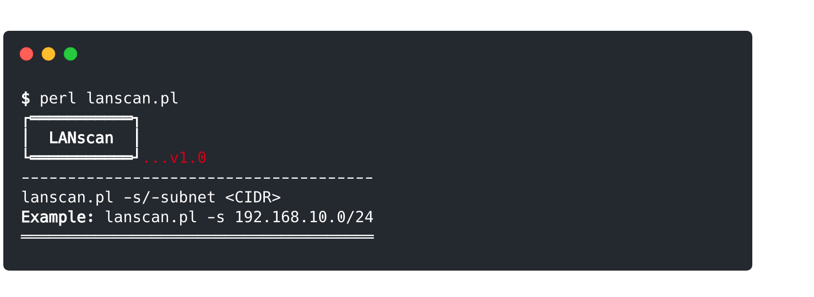

# LANscan 

**LANscan** is a _perl_ script that detects and gathers basic information for every device on the LAN. What is interesting about this tool is that it **doesn't** require elevated-privileges to be able gather those information. The way it works is simple. At first it runs an _un-privileged_ nmap arp-scan which only provides the "active" IPs on the network. Then it dumps the ARP-cache, obtaining this way the corresponding mac-addresses and then making a request to [macvendors.co](https://macvendors.co/api) API, it gathers the mac-address vendor if possible. `LANscan` has been successfully tested on both _macOS_ and _linux_ operating systems and should also be able to be used on _windows_.

### Requirements:

To install the requirements:

`cpanm --installdeps .`

`cpanm` command allows easy installation of CPAN modules and is part of the [App::cpanminus](https://metacpan.org/pod/distribution/App-cpanminus/bin/cpanm) distribution. Of course it's not the only way to install the dependencies.

**Note:** [`nmap`](https://nmap.org/) also must be installed.

### Disclaimer
> This tool is only for testing and academic purposes and can only be used where strict consent has been given. Do not use it for illegal purposes! It is the end user’s responsibility to obey all applicable local, state and federal laws. Developers assume no liability and are not responsible for any misuse or damage caused by this tool and software.

## License

This project is licensed under the GPLv3 License - see the [LICENSE](LICENSE) file for details